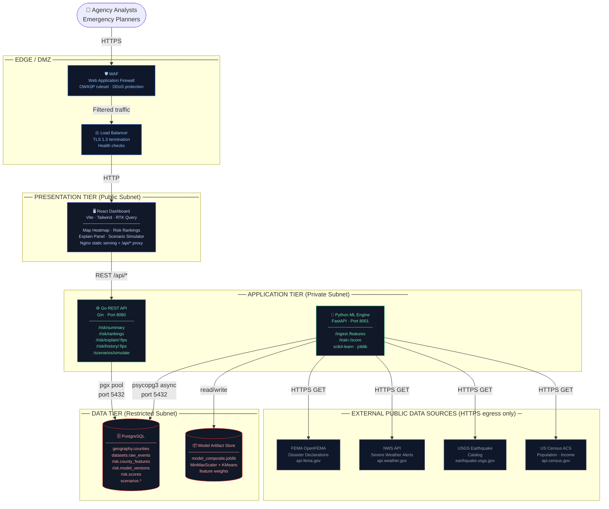

# PRISM — Architecture

## System Architecture Diagram



---

## 3-Tier Network Topology

| Tier | Subnet | Services | Access Control |
|---|---|---|---|
| **Edge / DMZ** | Public | WAF, Load Balancer | Internet-facing; only ports 443/80 inbound |
| **Presentation** | Public | React UI (Nginx) | Receives only WAF-filtered traffic |
| **Application** | Private | Go API, ML Engine | No direct internet inbound; API proxied from UI |
| **Data** | Restricted | PostgreSQL, Artifact Store | No internet access; accept only from App tier on port 5432 |

External API calls (FEMA, NWS, USGS, Census) originate from the ML Engine in the **private subnet** via controlled **HTTPS egress only** — no inbound ports opened.

---

## Data Flow

```
┌─ External Public APIs ──────────────────────────────────┐
│  FEMA · NWS · USGS · Census                             │
└───────────────────────────┬─────────────────────────────┘
                            │ HTTPS GET (ML Engine, egress)
                            ▼
                   [Ingestion Connectors]
                   Fetch → deduplicate → normalize
                            │
                            ▼
                   datasets.raw_events          ← PostgreSQL (Restricted Subnet)
                            │
                            ▼
                   [Feature Engineering]
                   90-day rolling window per county
                   LEFT JOIN ensures all 3,220 counties included
                            │
                            ▼
                   risk.county_features         ← PostgreSQL
                            │
                            ▼
                   [Model Training]
                   MinMaxScaler → composite weights → K-Means (k=5)
                   Artifact → model_composite.joblib
                            │
                            ▼
                   risk.model_versions          ← PostgreSQL
                            │
                            ▼
                   [Scoring]
                   Load artifact → score 3,220 counties → assign Tier 1–5
                            │
                            ▼
                   risk.scores                  ← PostgreSQL
                            │
                    ┌───────┘
                    ▼
           Go API (/risk/*, /scenarios/*)       ← Application Subnet
                    │ REST JSON
                    ▼
           React Dashboard                      ← Presentation Tier
           Map · Rankings · Explain · Scenarios
```

---

## Database Schema

| Schema | Table | Description |
|---|---|---|
| `geography` | `counties` | 3,220 US counties — FIPS, name, state, population, median income |
| `datasets` | `raw_events` | Normalized ingestion records — source, event type, county, severity, date |
| `risk` | `county_features` | Engineered feature vectors — 8 features per county per window |
| `risk` | `model_versions` | Model registry — type, artifact path, metrics, active flag |
| `risk` | `scores` | Risk outputs — score, level, confidence band, cluster tier, top drivers |
| `scenarios` | `scenarios` | Saved scenario definitions — name, parameters |
| `scenarios` | `scenario_results` | Per-county simulation outputs — delta scores, resource allocation |

Schema migrations are versioned in `environments/local/migrations/` and applied on container startup.

---

## Service Responsibilities

### Presentation — React UI (`apps/ui`)
- RTK Query manages all data fetching, caching, and cache invalidation
- Leaflet + TopoJSON renders the county choropleth map (3,220 polygons)
- No business logic — all risk computation is server-side
- Communicates exclusively with Go API via `/api/*` proxy (never directly to ML Engine)

### Application — Go REST API (`services/api`)
- Thin handlers: validate request → execute sqlc-generated query → serialize response
- All SQL is type-safe and generated from annotated query files (`sql/queries/`)
- Scenario simulation runs in-process: applies multiplier to baseline scores, executes greedy resource pre-positioning algorithm
- No ML dependencies — reads pre-computed scores from PostgreSQL only

### Application — Python ML Engine (`services/ml-engine`)
- Four independent data connectors (FEMA, NWS, USGS, Census) — each pluggable and replaceable
- Feature engineering computes rolling 90-day windows; LEFT JOIN from `geography.counties` ensures all counties receive a score even with no active events
- Training fits MinMaxScaler and K-Means on current county features; persists artifact to disk and registers model version in PostgreSQL
- Scoring loads artifact, scores all counties in a single pass, writes results to `risk.scores`
- Triggered on demand via FastAPI endpoints or Makefile targets

### Data — PostgreSQL
- Single source of truth for all persistent state
- Domain schemas enforce strict separation (no cross-schema joins in application queries)
- Connection pooling: pgx pool (Go, 10 connections), psycopg3 async (Python, 5 connections)
- Row-level audit fields (`computed_at`, `created_at`) on all risk tables

---

## Local Networking (Docker Compose)

```
Internet
    │ :3000
┌───▼──────┐     /api/*      ┌──────────┐     :5432    ┌──────────┐
│ prism-ui │ ─────────────► │ prism-api │ ─────────────► │          │
│  (Nginx) │                └──────────┘                │ prism-   │
└──────────┘                                            │ postgres │
                             ┌──────────┐     :5432    │          │
                             │ prism-ml │ ─────────────► │          │
                             └──────────┘                └──────────┘
                                  │
                            HTTPS egress only
                         FEMA · NWS · USGS · Census
```

All inter-service communication uses Docker service names — no `localhost` references. The ML Engine is not exposed to the UI or the internet directly.

---

## Government Cloud Deployment Path

```
Local (current)                Agency Pilot (Phase 1)           Enterprise (Phase 2)
─────────────────────          ────────────────────────          ──────────────────────
Docker Compose          →      FedRAMP-authorized cloud   →      Multi-region HA
Single host                    (AWS GovCloud / Azure Gov)         Kubernetes (EKS/AKS)
make docker-up                 Managed PostgreSQL (RDS)           GitOps deployment (Flux)
                               Container registry (ECR)           Zero Trust networking
                               Secrets Manager (KMS)              SIEM integration
                               CloudTrail audit logging           SLA-backed uptime
                               WAF (AWS WAF / Azure FW)           Satellite imagery layer
                               Private VPC with VPN/Direct Conn
```

### Security Controls (FedRAMP Moderate Alignment)

| Control Family | Implementation |
|---|---|
| **AC — Access Control** | Service-to-service via internal network only; no shared credentials |
| **AU — Audit & Accountability** | Request logging on all API handlers; model version audit trail in DB |
| **SC — System & Communications** | TLS 1.3 in transit; encrypted volumes at rest |
| **SI — System Integrity** | Immutable container images; pinned base image digests |
| **CM — Configuration Mgmt** | Infrastructure as code (Docker Compose → Kubernetes manifests) |
| **RA — Risk Assessment** | PRISM itself is a risk assessment tool; model methodology documented |

---

## Expansion Path

### Phase 1 — Agency Pilot

#### State EOC Integration Interface

PRISM's Go API is the natural integration point for state Emergency Operations Centers. The planned interface is a **webhook receiver** endpoint that accepts incoming incident reports from EOC systems:

```
POST /api/integrations/eoc/events
Content-Type: application/json
X-EOC-Token: <shared-secret>

{
  "county_fips": "06037",
  "incident_type": "wildfire",
  "severity": 0.85,
  "reported_at": "2026-03-22T14:30:00Z",
  "source_agency": "CAL OES"
}
```

Received events are written to `datasets.raw_events` with `source = "eoc_push"` and trigger a partial re-score for the affected county. This allows PRISM to incorporate real-time ground-truth reports alongside its public data feeds without replacing the existing pipeline.

**Alternatively**, PRISM can push risk alerts to EOC systems on score threshold crossings:

```
POST <eoc-webhook-url>
{
  "county_fips": "06037",
  "county_name": "Los Angeles County, CA",
  "risk_score": 84.2,
  "risk_level": "critical",
  "top_drivers": [...],
  "triggered_at": "2026-03-22T15:00:00Z"
}
```

This push model requires adding a notification service (Go goroutine or Lambda) and a subscriber registry in the database.

#### Logistics Optimization Service

The current scenario simulator uses a greedy resource pre-positioning algorithm (highest delta-risk first). A dedicated logistics optimization service would replace this with a proper constrained allocation model:

```
┌─────────────────────────────────────────────────┐
│  Logistics Optimization Service (future)         │
│                                                  │
│  Inputs:                                         │
│    risk.scores (county risk + delta)             │
│    resource inventory (type, quantity, location) │
│    travel time matrix (county → depot)           │
│                                                  │
│  Algorithm:                                      │
│    Mixed-integer programming (PuLP / OR-Tools)   │
│    Minimize: unmet need × severity weight        │
│    Subject to: resource capacity, travel time    │
│                                                  │
│  Output:                                         │
│    Per-county allocation plan                    │
│    Deployment sequence + route                   │
└─────────────────────────────────────────────────┘
```

This would be extracted as a standalone domain service (`services/logistics`) following the existing modular monolith pattern, with its own schema (`logistics.*`) and REST endpoints consumed by the scenario simulator.

---

### Phase 2 — Enterprise Disaster Intelligence Platform

#### Satellite Imagery Integration

Satellite imagery provides direct observational data on infrastructure damage, flood extent, and fire perimeters — signals that lag significantly in FEMA declarations or NWS alerts.

```
┌─ Imagery Ingest Layer ────────────────────────────────────┐
│                                                            │
│  Sources:                                                  │
│    Sentinel-2 (ESA, free) — 10m resolution, 5-day revisit │
│    Landsat 9 (USGS, free) — 30m resolution, 16-day revisit│
│    Commercial (Planet, Maxar) — near-daily, licensed       │
│                                                            │
│  Ingest Worker (Python)                                    │
│    ├─ Fetch scene for affected county BBOX                 │
│    ├─ Run change detection vs. pre-event baseline          │
│    ├─ Extract damage proxy metric (0–1)                    │
│    └─ Write to datasets.raw_events (source = "satellite")  │
│                                                            │
│  Integration Point:                                        │
│    New BaseConnector subclass — slots into existing         │
│    ingestion pipeline with no schema changes               │
└────────────────────────────────────────────────────────────┘
```

The existing `raw_events` schema accommodates satellite-derived events. The feature engineering layer would add a new `satellite_damage_score` feature column to `risk.county_features`.

#### Secure Cloud Deployment Path (Phase 2)

```
Phase 1 (current)                    Phase 2
──────────────────────────           ──────────────────────────────────────
AWS ECS Fargate (containerized)  →   Kubernetes (EKS / AKS GovCloud)
Single-region (us-east-1)        →   Multi-region active-passive
RDS PostgreSQL                   →   RDS Multi-AZ + read replicas
S3 + CloudFront (static)         →   Global CDN with geo-routing
Secrets Manager (KMS)            →   Zero Trust / SPIFFE workload identity
CloudTrail logging               →   SIEM integration (Splunk / Chronicle)
Manual model deploys             →   GitOps (Flux / ArgoCD) + model registry
```

The containerized ECS architecture is intentionally Kubernetes-compatible — the same Docker images run unchanged on EKS. Migration is a re-platform operation, not a rewrite. Kubernetes manifests would replace the current ECS task definitions and are a natural follow-on to the existing Terragrunt infrastructure-as-code.

**Key additions for Phase 2 hardening:**
- Horizontal Pod Autoscaler on the Go API (traffic spikes during disasters)
- Separate node pools for ML training workloads (GPU-enabled nodes for imagery processing)
- Network policies enforcing zero east-west traffic by default
- OPA/Gatekeeper admission control for FedRAMP High policy enforcement
